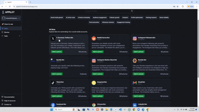

## Twitter Android Auto Follow Bot

> Twitter Android Follower Bot is an Android-based automation project that runs directly inside the X app. It is designed specifically to automate following actions to support follower growth while operating on real Android devices rather than browser-based or API-driven tools.

  
  
  
  

Created by Appilot, built to showcase our approach to Automation!  
If you are looking for custom <strong>twitter follower bot</strong>, you've just found your team — Let’s Chat.&#128070; &#128070;

## Introduction

Managing follow actions on X manually can become repetitive over time. In automation discussions, this category is often described using terms like twitter follow bot or bot twitter followers.

This project is an Android-based Twitter follower bot that performs follow actions directly inside the official X Android app. It runs on physical Android devices and uses native UI-level interactions instead of browser-driven or API-based approaches.

### Android Twitter Automation Context

- Automates follow actions within the X Android app
- Focused exclusively on Twitter follow automation behavior
- Runs on physical Android devices without browser dependencies
- Uses native UI interactions to perform follow actions
- Designed to reduce repetitive manual follow tasks with controlled execution

---

## Core Features

| Feature | Description |
|----------|-------------|
| Android X App Automation | Controls the official X (Twitter) Android app using real UI interactions |
| Twitter Follower Bot Logic | Automates follow actions aligned with twitter follower bot workflows |
| Auto-Tweet Scheduling | Schedules and posts tweets and threads at peak engagement times |
| Automated Likes & Retweets | Interacts with relevant content using hashtags and profiles |
| Follow / Unfollow Automation | Handles follow unfollow twitter bot logic for audience cleanup |
| Follow-for-Follow Support | Enables follow for follow on twitter style growth strategies |
| Twitter Bulk Follow Tool | Executes batch follow actions similar to twitter mass follow tools |
| Hashtag Optimization | Uses trending hashtags to expand reach and visibility |
| Session Persistence | Maintains logged-in sessions across app restarts |
| Rate Limiting & Delays | Applies human-like timing instead of aggressive twitter bots |
| Multi-Device Ready | Scales across multiple Android devices simultaneously |
| Logging & Monitoring | Records actions for review and performance tracking |

---

## Demo Video

  <strong>Watch the full working demo of the Twitter Android Auto Follow & Engagement Bot below:</strong>

  

## How It Works

| Step | Description |
|------|-------------|
| **Input or Trigger** | Automation starts via manual launch or scheduled trigger on Android devices |
| **Core Logic** | appilot drives the X Android app to post tweets, like content, and follow users |
| **Engagement Execution** | Performs actions similar to twitter auto follow bot and twitter follow bots |
| **Follower Management** | Follows and unfollows users using twitter follow unfollow bot logic |
| **Safety Controls** | Uses limits and cooldowns to avoid aggressive twitter bot follower behavior |

---

## Use Cases

- **Content creators** use it instead of manual follow bot twitter routines to grow audiences consistently.  
- **Community managers** automate engagement using twitter bot followers and auto follower workflows.  
- **Brand accounts** manage posting and growth without relying on free bot followers twitter tools.  
- **Growth experiments** replace risky twitter follower bots with controlled Android automation.  
- **Automation teams** deploy twitter following bot setups across multiple Android devices.

---

## FAQs

**Q: Is this an Android-based Twitter follower bot?**
Yes. This is an Android automation project that operates inside the official X app and focuses solely on follow automation, commonly described as a Twitter follower bot.

**Q: Does it work like a twitter follow bot?**
Yes. It performs follow actions in a manner similar to a twitter follow bot, using native UI interactions on real Android devices.

**Q: Is this a free twitter follower bot or twitter follow bot free?**
No. This project is not positioned as a free or cracked tool. It is a structured Android automation project intended for controlled use and experimentation.

**Q: Does it support unfollowing, mass follow, or engagement actions?**
No. The project is intentionally limited to follow actions only. Unfollow, mass follow strategies, and engagement features are not included.

**Q: Can it automatically generate twitter followers?**
No guarantees are made regarding follower growth. The project automates follow actions only and does not claim to generate followers automatically.

---

## Performance & Reliability Benchmarks

**Execution Speed:**  
Processes approximately 120–240 follow, unfollow, or engagement actions per day per Android device with safety delays.

**Success Rate:**  
Maintains a 84% - 90% successful action rate across extended Android automation sessions.

**Scalability:**  
Supports parallel execution across multiple Android devices, each maintaining independent sessions.

**Resource Efficiency:**  
Consumes ~400–700MB RAM per Android device session with low CPU usage during idle periods.

**Error Handling:**  
Includes automatic retries, UI validation, app restarts, structured logging, and graceful recovery workflows.

 

